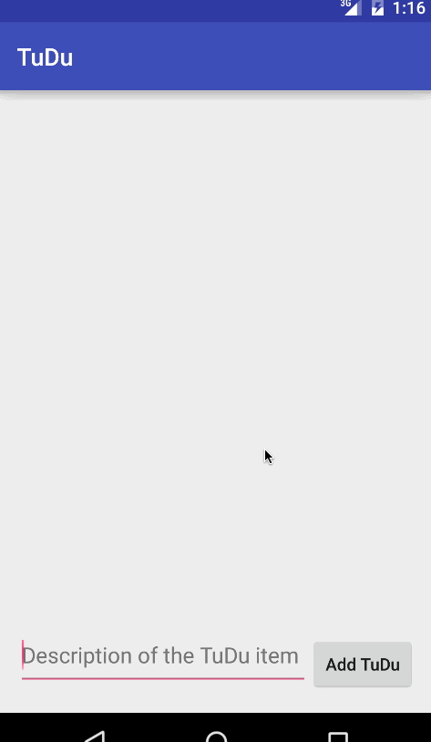

# Android Bootcamp Pre-work Application - Wonderlist TuDu Demo

(My prework project submission README)

Wonderlist TuDu is an Android demo application for organizing TuDu items in a list as per the [prework requirements and guidelines](http://courses.codepath.com/snippets/intro_to_android/prework).

Submitted by: *Ravi Kumar Mandala*

Time spent: 2 hours spent in total

User Stories:

* [x] Required: User can successfully add and remove items from the todo list
* [x] Required: User can tap a todo item in the list and bring up an edit screen for the todo item and then have any changes to the text reflected in the todo list.
* [x] Required: User can persist todo items and retrieve them properly on app restart
* [ ] Optional: Persist the todo items into SQLite instead of a text file
* [ ] Optional: Improve style of the todo items in the list using a custom adapter
* [ ] Optional: Add support for completion due dates for todo items (and display within listview item)
* [ ] Optional: Use a DialogFragment instead of new Activity for editing items
* [ ] Optional: Add support for selecting the priority of each todo item (and display in listview item)
* [ ] Optional: Tweak the style improving the UI / UX, play with colors, images or backgrounds
* [ ] (... List anything else that you can get done to improve the app functionality!)
 
Notes:
Spent some time making the UI work across multiple phone resolutions by playing around with the RelativeLayout.

Walkthrough of all user stories:

GIF created with [LiceCap](http://www.cockos.com/licecap/).
